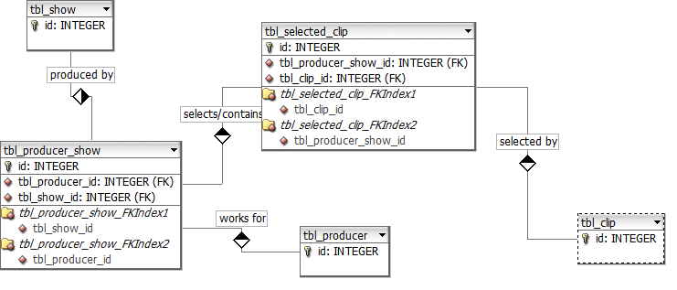

web2py-dal-plus-bottle
======================

An attemp to use web2py DAL(data access layer) and bottle to create a simple mvc microframe work. This is just an example practice to be used as a template. Currently only contains the DB model and some tests for a movie editing database. The schema is as following:   
   
   

##### Description

The DB design is created by following rules.  
Rules:

1. Producer may work on more than one show.
2. A producer may select a collection of clips for a show.
3. More than one show can use the same clips. 
4. There can be one million clips to select from.

The model.py has got the DB model plus some doctests which helps to understand how it works.

   
### References

* Excellent web2py examples from [Joe Codeswell DAL Quick reference](http://joecodeswell.wordpress.com/2011/05/25/web2py-dal-quick-reference/)

* [xmldict.py](https://github.com/thoughtnirvana/xmldict) library used to enable xml export option.
